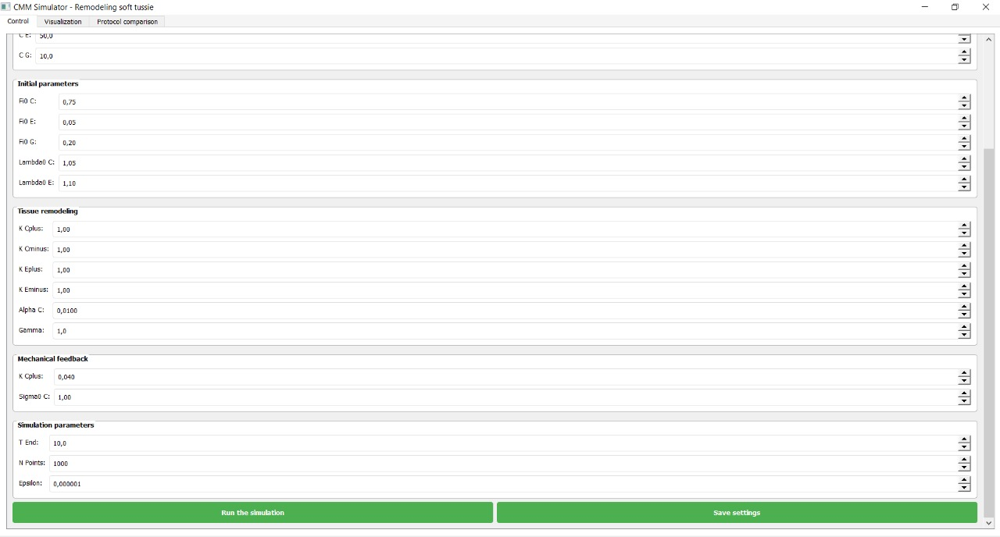
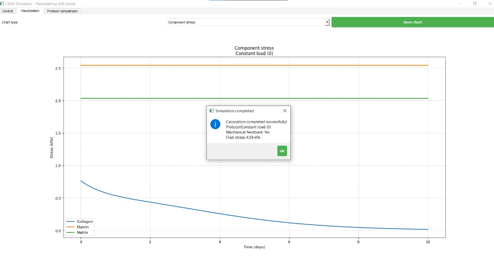
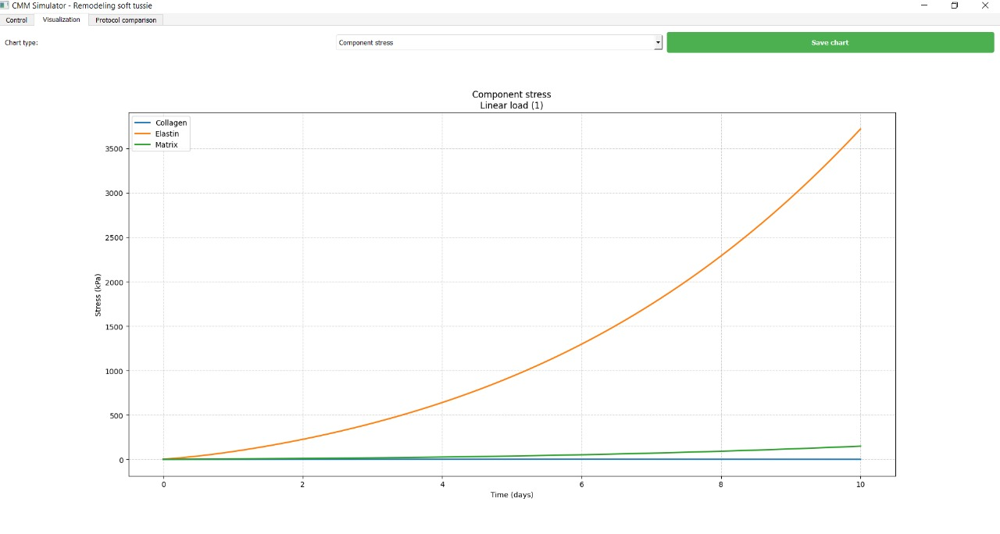
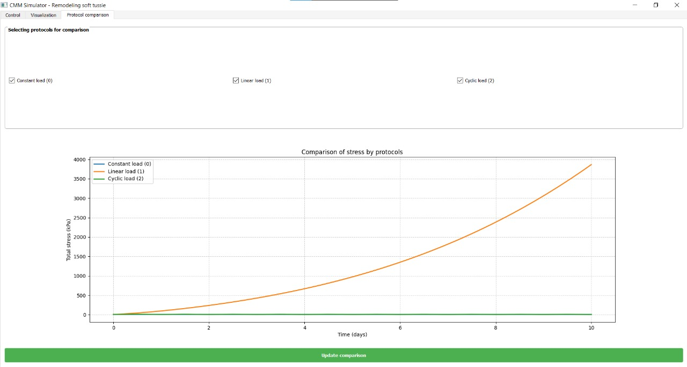
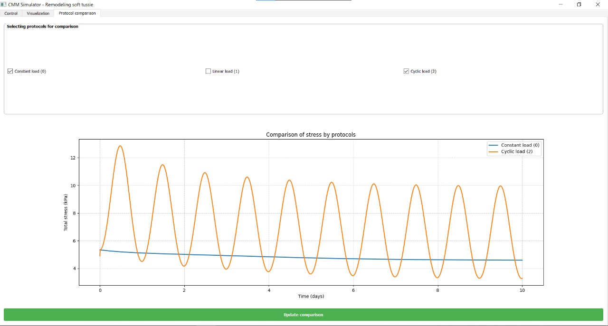
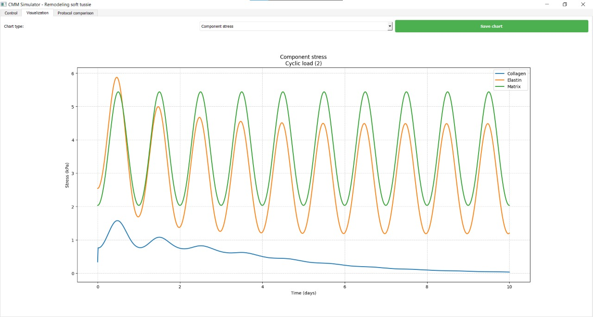

[](https://doi.org/10.5281/zenodo.16313091) # CMM Simulator - Remodeling Soft Tissue

This repository contains Python implementations of Constrained Mixture Models (CMM) for analyzing stress in soft tissues under various deformation protocols, with and without mechanical feedback. The models simulate tissue remodeling by considering collagen, elastin, and proteoglycan matrix components.

## Installation

To run the simulator, you'll need Python 3.6+ installed. Download Python from the official website: [https://www.python.org/](https://www.python.org/)

Install required dependencies:
```
pip install numpy scipy matplotlib PyQt5
```

## Usage

The simulator offers both GUI and CLI interfaces:

### GUI Mode (Recommended)
Run the graphical interface:
```
python main.py
```

### CLI Mode
Run simulations from command line:
```
python main.py --mode cli [protocol] [options]
```

Available protocols:
- `constant`: Constant stretch protocol
- `linear`: Linearly increasing stretch
- `cyclic`: Cyclic loading protocol
- `all`: Run all protocols simultaneously

Example:
```
python main.py --mode cli cyclic --feedback --c_c 2.0 --t_end 15
```

## Theory

The models implement constrained mixture theory for soft tissue remodeling, based on the framework described in:
- Taber, L. A. (2021). *Continuum Modeling in Mechanobiology*. Springer.

### Basic Equations

Total stress is computed as:
```math
σ = σ^c + σ^e + σ^g
```

#### Collagen Stress (σᶜ)
```math
σ_x^c(t) = \frac{J^c(0)}{J(0)}\bar{σ}_x^c(λ_x^{c*}(t, 0))q^c(t, 0) + \frac{j^{c+}}{J(t)} \int_0^t \bar{σ}_x^c(λ_x^{c*}(t, τ))q^c(t, τ) dτ
```

#### Elastin Stress (σᵉ)
```math
σ_x^e(t) = \frac{J^e(0)}{J(0)}\bar{σ}_x^e(λ_x^{e*}(t, 0))q^e(t, 0) + \frac{j^{e+}}{J(t)} \int_0^t \bar{σ}_x^e(λ_x^{e*}(t, τ))q^e(t, τ) dτ
```

#### Matrix Stress (σᵍ)
```math
σ_x^g(t) = 2ϕ^g c_g\left(λ^2 - \frac{1}{λ}\right)
```

### Mechanical Feedback Extension

The feedback model modifies collagen production rate:
```math
j^{c+}(t) = \frac{J^c(t)}{J^c(0)} j_0^{c+}[1 + K^{c+}(\hat{σ} - 1)]
```
where:
- $\(\hat{σ} = \frac{σ^c}{σ_0^c}\)$ is normalized stress
- $\(K^{c+}\)$ is feedback coefficient
- $\(σ_0^c\)$ is homeostatic stress

## Protocols

### Constant Stretch


### Cyclic Stretch


### Linear Increasing Stretch


### With Mechanical Feedback


## Example of how the simulator works








## Repository Structure
```
CMM_Simulator/
├── main.py                # Main entry point
├── core/
│   ├── models.py          # Core mathematical models
│   └── constants.py       # Default parameters
└── ui/
|   ├── gui.py             # Graphical interface
|   └── cli.py             # Command line interface
└── data/

```

## Contributing

Contributions are welcome! Please:
1. Fork the repository
2. Create your feature branch
3. Commit your changes
4. Push to the branch
5. Open a pull request

For questions, contact: karina_urazova@icloud.com

***

**Thank you for your interest in the CMM Simulator project. This framework provides valuable tools for studying soft tissue remodeling in response to mechanical loading.**


